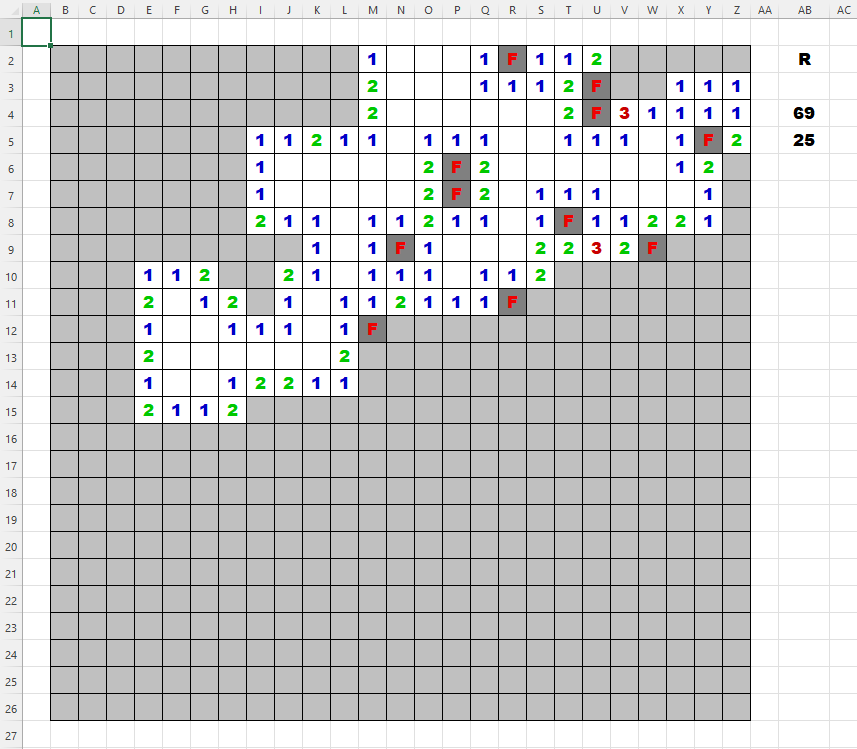
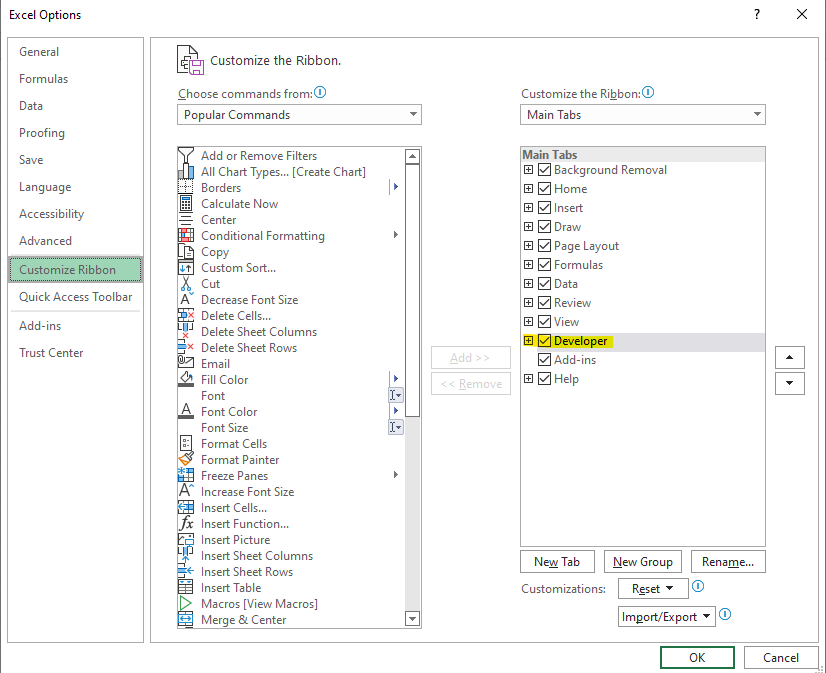
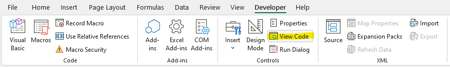
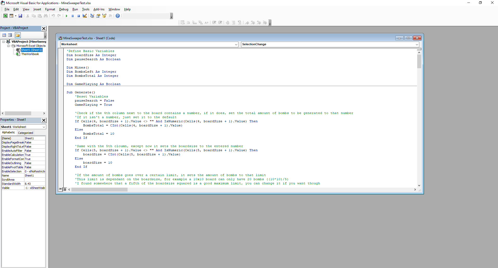
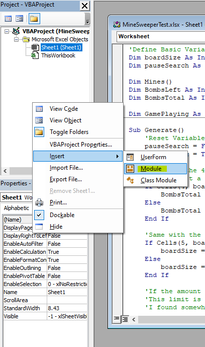
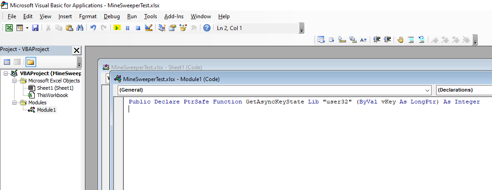

# Excel Minesweeper

Hey, so this is a smaller project of mine, where I tried to make a minesweeper clone in Excel. It contains all the features of the original, and could be a fun side project to do yourself.

## How to play

Clicking on the R cell will reset the game (or start it with the defined parameters). The first number is the amount of mines on the board, and the second number is the board size. Double clicking does work, however, if there's not many mines on the board, it will sometimes not clear the whole area (pretty sure this is a problem with Excel).

## How to make it yourself

First off, open Excel and create a blank sheet. If you can't see the Developer tab on the top ribbon (where you have Home, Insert...), go to _File -> Options_ (all the way at the bottom of the left panel). This will open up the Excel Options window. Here, go to the Customize Ribbon Tab, and in the right list, make sure that Developer has a checkmark next to it.

To actually load the code, open the Developer tab and click on View Code. 

This will open up a new window called _Microsoft Visual Basic for Applications_, and you're already going to have a Window open within it, probably called _Sheet1 (Code)_. Here, you have to paste the _gameMain_ script.

There's one more thing you need to do, and that's add a module. In the file structure window at the left, right click, _Insert -> Module_. 

This will open a new window, and here you simply paste the code from _specialLine_ and press Enter. Now you are ready to go. Click on the play button at the top, and in the new window that pops up, click _Run_. 

Now return back to your Excel file, and the game should be running. 

I believe you can only save the file as a macro, and every time you open it, you have to go to the dev bar, view code and run it manually. 

I tried to comment the main code, so you can look through that if you'd like. The specialLine code is just a simple line which allows right clicking (I think). 
